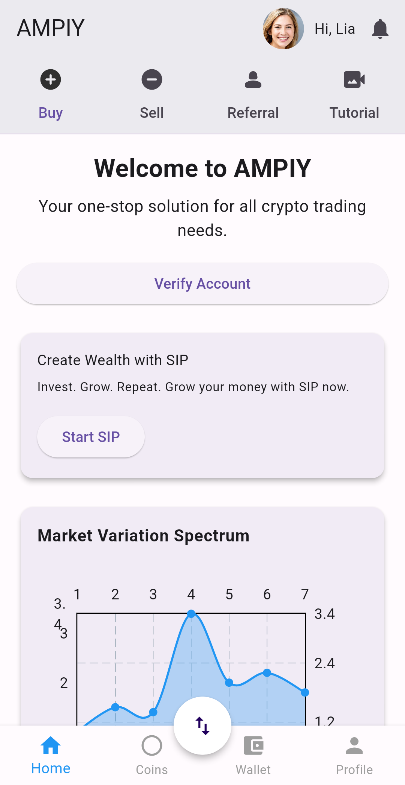
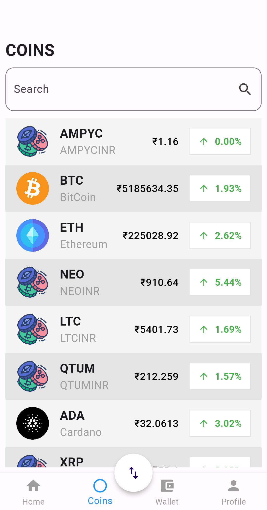

# Flutter Internship Interview Task

## Overview

This project is an assignment for the Flutter internship interview. The task involves enhancing the UI of the **AMPIY** app's Home Page and replicating the Coins Screen to display data using WebSocket.

## Task Details

1. **Improve the UI for the AMPIY App’s Home Page**:
   - Download the app from the [Google Play Store](https://play.google.com/store/apps/details?id=com.ampiy.app).
   - Implement only the Home Page of the app.
   - Use creativity to design a better-looking UI.

2. **Replicate the Coins Screen and Display Data from WebSocket**:
   - Replicate the Coins Screen of the app.
   - Integrate WebSocket to fetch and display real-time cryptocurrency data on the Coins Screen.

## Screen Recording
[Link to the video](assets/Video/AMPIY-Assignment-Recording.mp4)


## Screenshots

### Home Screen


### Coins Screen


## Installation

To run this project locally, follow these steps:

### Prerequisites

- **Flutter**: Ensure you have Flutter installed on your local machine. You can download it from [Flutter's official website](https://flutter.dev/docs/get-started/install).
- **Dart**: Dart is included with the Flutter SDK, so no additional installation is necessary.

### Clone the Repository

```
git clone https://github.com/yourusername/ampiy-app-assignment.git
cd ampiy-app-assignment
```

### Install Dependencies
```
flutter pub get
```

### Run the app

```
flutter run
```
### Directory Structure
```
ampiy-app-assignment/
|- android/                # Android-specific files
|- assets/                 # Assets such as images
|- ios/                    # iOS-specific files
|- lib/
   |- screens/             # Screens of the app
   |- widgets/             # Reusable widgets
   |- main.dart            # Main entry point of the application
|- test/                   # Test files
|- pubspec.yaml            # Flutter dependencies and assets configuration
|- README.md               # Documentation file
```
## Overview

1.There were couple of things that could have been better, such as the icons in Coins screen. It would've been great to have another API that returns URL of the icons and subnames of the coins we get from websocket API.

2.Home Page is very important and should be the "GO-TO" for the user. Made a few changes, I thought would enhance the Home screen, hope you like it.